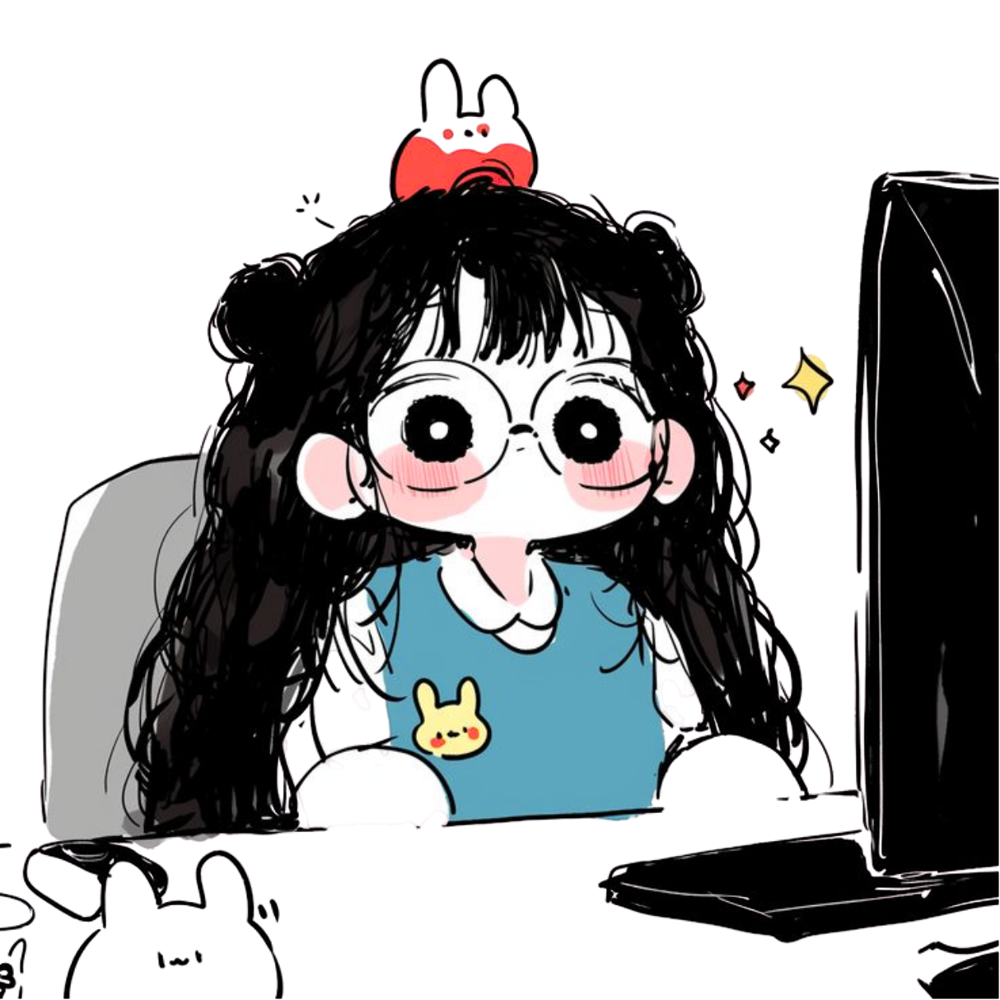

  <picture>
    <source media="(prefers-color-scheme: dark)" srcset="./assets/githubannerdark.svg">
    <source media="(prefers-color-scheme: light)" srcset="./assets/githubanner.svg">
    
  </picture>

  
  
  
  
  

 

<b>━━━━━━━━━━━━━━━━━━━━━━━━━━━━━━━━━━━━━━━━━━━━━━━━━━━━━━━━━━━━━━━━━━━━━━━━━━ ✦ SOBRE MIM ✦</b>
   

   

Estudante de <b>Ciência 
  Estudante de Ciência da Computação e Desenvolvedora Mobile focada em Flutter, acessibilidade digital e tecnologias assistivas. Desenvolvo aplicações que unem design, tecnologia e impacto social, criando experiências mais inclusivas e acessíveis.

 
 

<b>✦ MEUS PRINCIPAIS PROJETOS e SKILLS ✦ ━━━━━━━━━━━━━━━━━━━━━━━━━━━━━━━━━━━━━━</b>
  
         

✦ **HandHelp** | Flutter • Acessibilidade | Comunicação inclusiva para pessoas surdas em triagens de saúde, com suporte em Libras.

✦ **HandBits** |  Visão Computacional • Python • Educação | Aprendizado de lógica binária através do reconhecimento de gestos das mãos.

✦ **NadoFit** |  Flutter • UX/UI | Plataforma para escolas de natação com foco em experiência do usuário e interface moderna.

✦ **VinculoTEA** | React • Educação Inclusiva | Apoio ao acompanhamento de estudantes com TEA, com gestão, relatórios e PEI.

 

<b>━━━━━━━━━━━━━━━━━━━━━━━━━━━━━━━━━━━━━━━━━━━━━━━━━━━━━━━━━━━━━━━━━━━━━━━━━━━━━━━ ✦ ESTATÍSTICAS ✦</b>
       
 

 

     
<b>✦ CONTATO ✦ ━━━━━━━━━━━━━━━━━━━━━━━━━━━━━━━━━━━━━━━━━━━━━━━━━━━━━━━━━━━━━━━━━━━━━━━━━━━━━━━━━━━━━━━━━━━</b>

 
  
  
  &nbsp;
  
  &nbsp;
  
  &nbsp;
 

